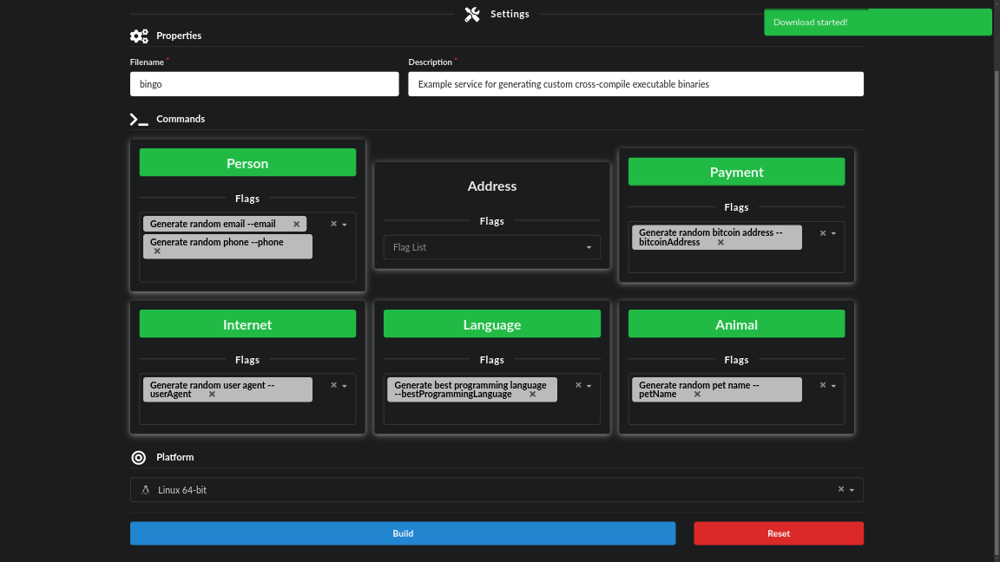

<h1 align="center">

<!-- [](https://github.com/bastean) -->

[](https://github.com/bastean/bingo)

</h1>

<div align="center">

> Example service for generating custom cross-compile executable binaries

</div>

<br />

<div align="center">

[](LICENSE)
[](https://goreportcard.com/report/github.com/bastean/bingo)
[](https://github.com/commitizen/cz-cli)
[](https://github.com/release-it/release-it)

</div>

<div align="center">

[](https://github.com/bastean/bingo/actions/workflows/upgrade.yml)
[](https://github.com/bastean/bingo/actions/workflows/ci.yml)
[](https://github.com/bastean/bingo/actions/workflows/release.yml)

</div>

<div align="center">

[](https://pkg.go.dev/github.com/bastean/bingo)
[](https://github.com/bastean/bingo/releases)

</div>

## Usage

```bash
make demo
```

### Screenshots

<div align="center">




</div>

### Binary

```bash
chmod +x bingo
```

```bash
./bingo --help
```

```text
Example service for generating custom cross-compile executable binaries

Usage:
  bingo [flags]
  bingo [command]

Available Commands:
  animal      Generate random animal information
  completion  Generate the autocompletion script for the specified shell
  help        Help about any command
  internet    Generate random internet information
  language    Generate random language information
  payment     Generate random payment information
  person      Generate random person information

Flags:
  -h, --help   help for bingo

Use "bingo [command] --help" for more information about a command.
```

```bash
./bingo person --help
```

```text
Generate random person information

Usage:
  bingo person [flags]

Flags:
      --email   Generate random email
  -h, --help    help for person
      --phone   Generate random phone
```

## First Steps

### Clone

#### HTTPS

```bash
git clone https://github.com/bastean/bingo.git && cd bingo
```

#### SSH

```bash
git clone git@github.com:bastean/bingo.git && cd bingo
```

### Initialize

#### Dev Container (recommended)

1. Install required

   - [Docker](https://docs.docker.com/get-docker)

     - [Dev Containers](https://marketplace.visualstudio.com/items?itemName=ms-vscode-remote.remote-containers)

2. Start VS Code

   ```bash
   code .
   ```

3. Open Command Palette

   - Ctrl+Shift+P

4. Run

   ```txt
   Dev Containers: Reopen in Container
   ```

#### Locally

1. Install required

   - [Go](https://go.dev/doc/install)
   - [Node](https://nodejs.org/en/download)
   - [Make](https://www.gnu.org/software/make)
   - [Docker](https://docs.docker.com/get-docker)

2. Run

   ```bash
   make init
   ```

#### ZIP

1. [Install required](#locally)

2. Run

   ```bash
   make init-from-zero
   ```

### Run

#### ENVs

> [!IMPORTANT]
> Before running it, you must set the following environment variables and rename the file to **.env.(dev|test|prod)**
>
> - [.env.example](deployments/.env.example)

> [!TIP]
> You can check the demo file to see which values you can use
>
> - [.env.example.demo](deployments/.env.example.demo)

#### Development

```bash
make compose-dev
```

#### Test

- Unit

  ```bash
  make test-unit
  ```

- Integration

  ```bash
  make test-integration
  ```

- Acceptance

  ```bash
  make compose-test-acceptance
  ```

- All

  ```bash
  make compose-test-all
  ```

#### Production

```bash
make compose-prod
```

## Tech Stack

#### Base

- [Go](https://go.dev)
- [templ](https://templ.guide)
  - [Fomantic-UI](https://fomantic-ui.com)

#### Please see

- [go.mod](go.mod)
- [package.json](package.json)

## Contributing

- Contributions and Feedback are always welcome!

## License

- [MIT](LICENSE)
